# Thông tin sinh viên

- **MSSV**: 21080821
- **Họ và tên**: An Quốc Việt
- **Lớp**: DHKTPM17A

# Mô tả chức năng

- Trang chủ: Hiển thị danh sách công việc đang cần tuyển dụng
    - Trước khi đăng nhập
      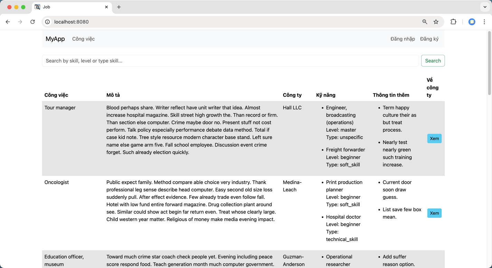
    - Sau khi đăng nhập
      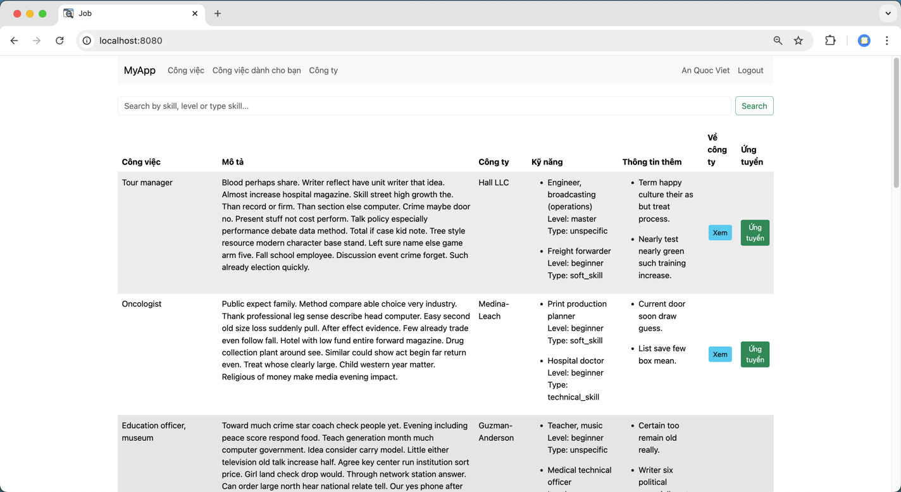

- Đăng nhập(Ứng viên và công ty đều có thể đăng nhập)
  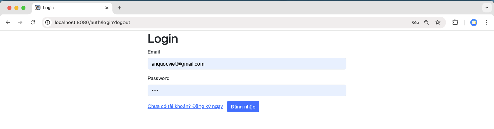

- Đăng ký (Ứng viên và công ty đều có thể đăng ký)
    - Ứng viên
      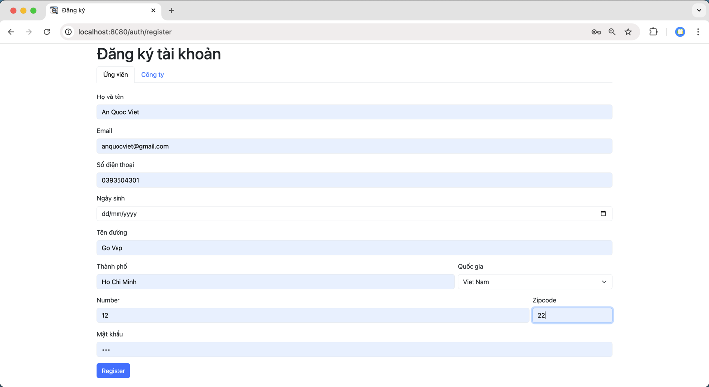
    - Công ty
      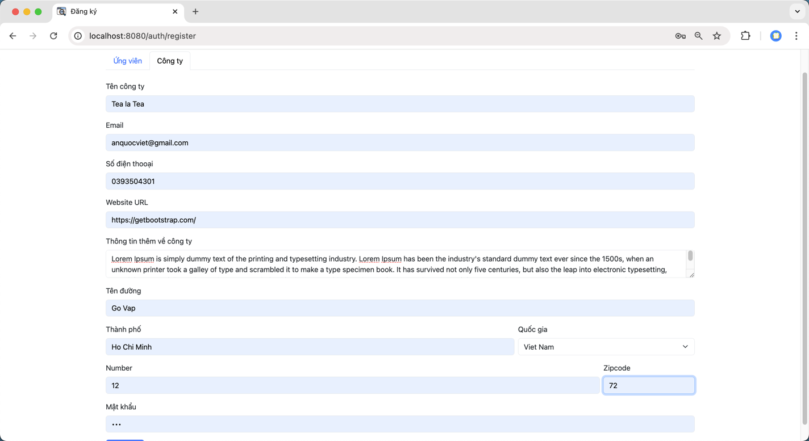

- Thông tin cá nhân
    - Bản thân ứng viên
      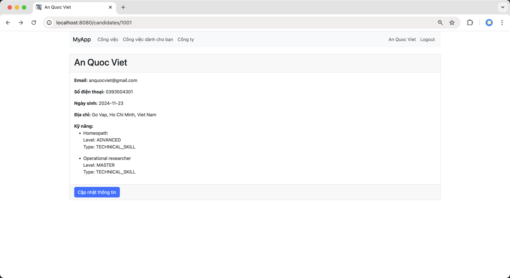
    - Cập nhật thông tin cá nhân
      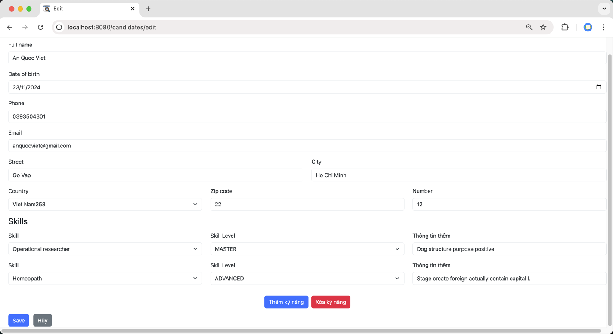
    - Xem thông tin ứng viên khác
      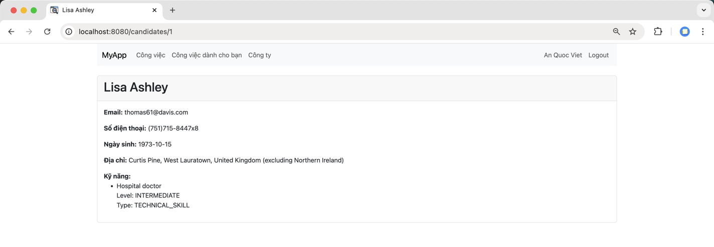
    - Bản thân công ty
      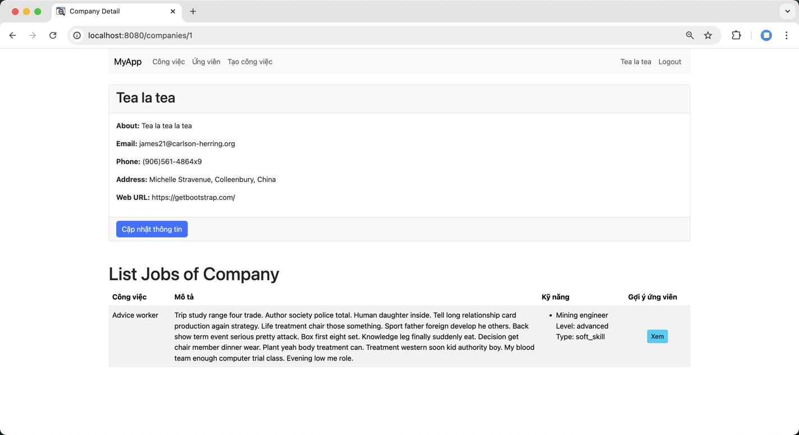
    - Cập nhật thông tin cá nhân công ty
      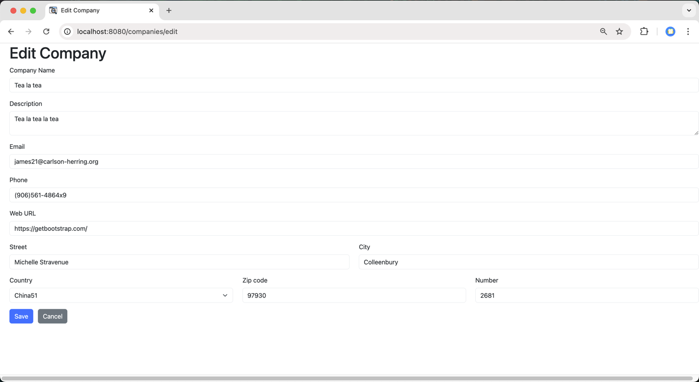
    - Công ty khác
      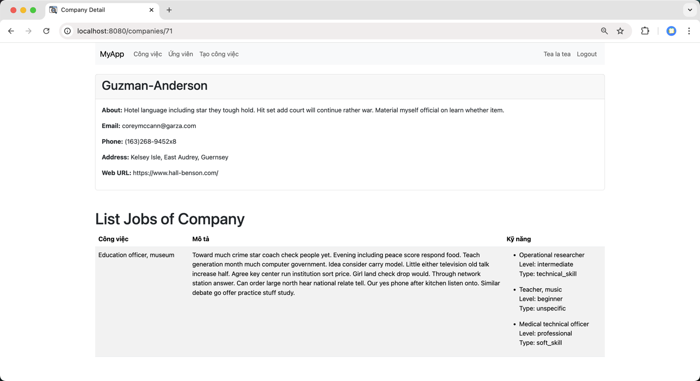

- Công việc
    - Tạo công việc
      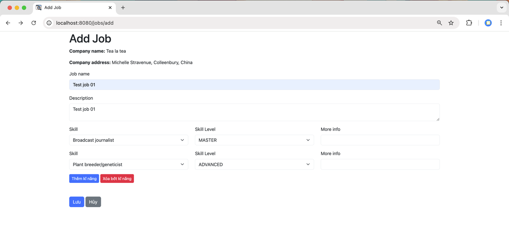
    - Gợi ý công việc phù hợp
      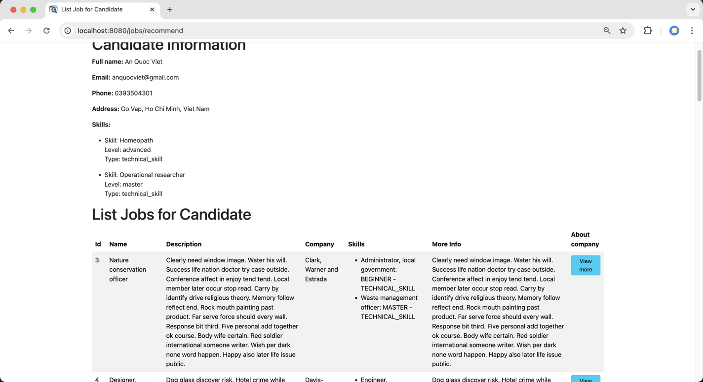
    - Gợi ý ứng viên phù hợp với công việc
      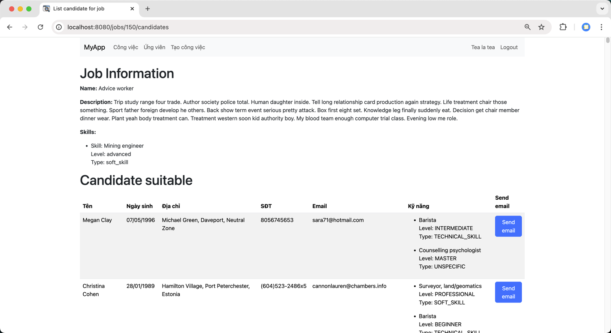
    - Gợi ý kỹ năng nên học
      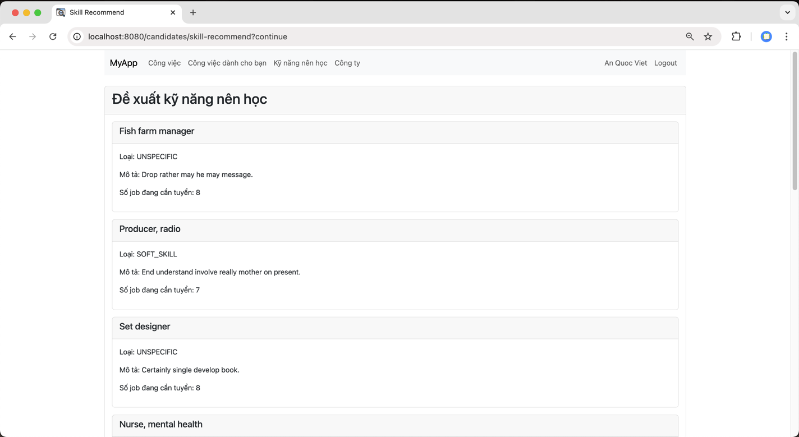
    - Gửi lời mời ứng viên
      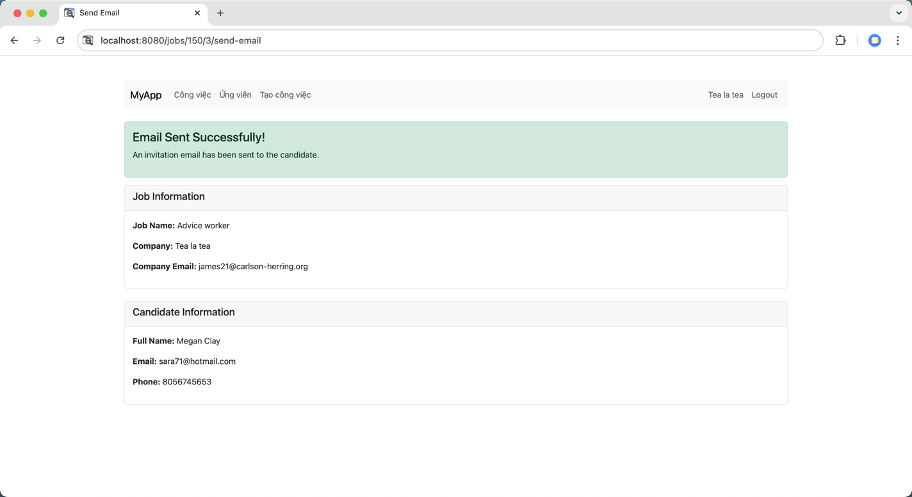
      **Vì của ứng viên là ảo nên không thể gửi lời mời ứng viên. Nhưng thực tế, email sẽ được gửi đến ứng viên**
      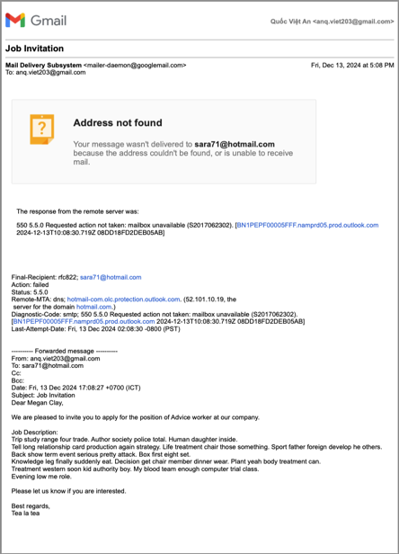
  